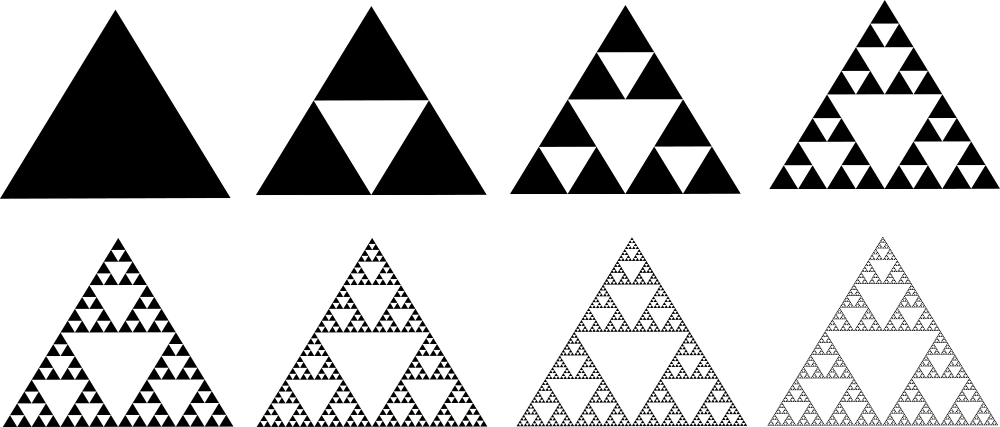
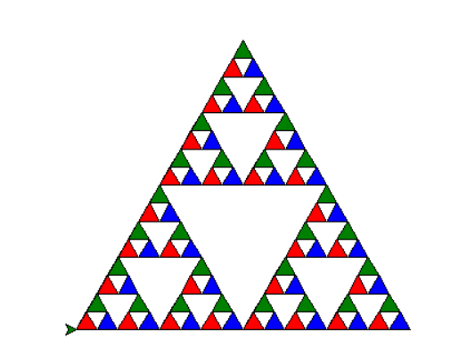

# Introduction to `turtle`

In this lecture, we will discuss Python's `turtle` module, which allows us to draw lines on the screen. We will see how simple commands like "forward", "left", and "right" can be combined with the programming techniques we've learned so far to create complex shapes with minimal effort.

Documentation for Python's `turtle` module can be found here: [https://docs.python.org/3/library/turtle.html](https://docs.python.org/3/library/turtle.html)

{width=50%}

## Forward, left, and right

We begin by importing everything from the `turtle` Python module, as we did with Tkinter:

```python
from turtle import *
```

This will bring all the relevant information into scope for us.

Now, let's try moving the turtle forward 100 steps:

```python
forward(100)
```

If we run this program, a window just flashes on the screen without sticking around for us to see what happens. We can fix this by calling `mainloop()` at the bottom of our program, as we did with Tkinter previously:

```python
from turtle import *

forward(100)

mainloop()
```

The reason this is the same as with Tkinter is because the turtle window actually uses Tkinter under the hood.

Now, the turtle (really just an arrow currently) should have drawn something like this to the screen:

{width=25%}

Next, let's try using the `left` command to make the turtle draw an equilateral triangle:

```python
from turtle import *

forward(100)
left(120)
forward(100)
left(120)
forward(100)

mainloop()
```

{width=25%}

By rotating 120 degrees left between drawing each line, we have created 60 degree angles between each of the lines - which, as you should know from geometry class, creates an equilateral triangle.

**\underline{Exercise 1:}** Create a square.

Copying the lines 3 times is fine for a triangle, but what if we want to do an octagon? We'd need to copy the lines 8 times. You should already recognize that we can use a loop to save ourselves the effort:

```python
# draw an octagon
for _ in range(8):
    forward(100)
    left(45)
```

{width=25%}

How did we know that we'd need to turn 45 degrees for an octagon? Well, I looked it up. But there's also a formula:
$$\angle_{\text{interior}}(n) = (n-2) \times \frac{180}{n}$$

Here, $\angle_{\text{interior}}(n)$ refers to the interior angle of an $n$-gon, or a regular polygon with $n$ sides. This checks out for the octagon: $(8-2) \times \frac{180}{8} = 135$. When we turn the turtle using `left`, we are creating the exterior angle, so we subtract the interior angle from 180 to get $180 - 135 = 45$.

**\underline{Exercise 2:}** Write a function `draw_n_gon(n)` to draw an $n$-gon using the same logic as with the octagon.

We can also turn right, like so:

```python
for _ in range(6):
    forward(100)
    right(60)
```

{width=25%}

Everything that you can do with `right` can be done with `left` by specifying a negative angle, so it's not really needed but can be useful if you want to use the intuition of turning right or left.

## Stars and speed

So far, we have been sticking to regular polygons. Let's mix things up by creating a star:

```python
for _ in range(5):
    forward(100)
    right(36)
```

{width=25%}

The formula for the interior angles of an $n$-pointed star isn't trivial, so let's just have our program run until it touches a point we've already been to before. We can do this using the `position()` function, which gives us the $x$ and $y$ coordinates of the current position of the turtle, and using a `set` to store the locations we've visited already:

```python
from turtle import *

x = 135
positions = set()
while position() not in positions:
    positions.add(position())
    forward(100)
    right(x)

mainloop()
```

{width=25%}

This works fine but it looks like the turtle runs for longer than it needs to before stopping. If we print out the coordinates each loop, we see the following:

```
(0.00,0.00)
(100.00,0.00)
(29.29,-70.71)
(29.29,29.29)
(100.00,-41.42)
(0.00,-41.42)
(70.71,29.29)
(70.71,-70.71)
(-0.00,-0.00)
(100.00,0.00)
(29.29,-70.71)
(29.29,29.29)
(100.00,-41.42)
(0.00,-41.42)
(70.71,29.29)
(70.71,-70.71)
```

Well, that's weird. This is probably due to **floating point error**. When computers do math, they store things pretty accurately, but at the end of the day they need to use zeros and ones for everything, which can make some math end up incorrect:

```python
>>> 0.1 + 0.2
0.30000000000000004
```

To see more information on why this happens, see this (aptly-named) webpage: [https://0.30000000000000004.com/](https://0.30000000000000004.com/)

So how can we fix this? An easy way is to just round the numbers to 2 decimal places:

```python
from turtle import *


def get_rounded_pos():
    pos_x, pos_y = position()
    rounded_pos = round(pos_x, 2), round(pos_y, 2)
    return rounded_pos


x = 135
positions = set()
while get_rounded_pos() not in positions:
    positions.add(get_rounded_pos())
    forward(100)
    right(x)

mainloop()
```

This works as expected.

Let's try this with a larger angle, like 165 degrees:

```python
x = 165
positions = set()
while get_rounded_pos() not in positions:
    positions.add(get_rounded_pos())
    forward(100)
    right(x)
```

{width=25%}

Cool! But now our turtle is starting to take a while to finish running. We can make the turtle faster by settings the speed like so:

```python
from turtle import *

speed(0)

... # rest of code

mainloop()
```

The fastest speed is "0", but even that can take a while - try, for example, setting `x` to `179`, and rerunning the above code.

We can make the turtle even *faster* if we only render the final product:

```python
from turtle import *

tracer(False)

... # rest of code

update()

mainloop()
```

Now, the window opens with the final image already created.

## Spirals and color

We've just been using `forward(100)` for everything so far. That's ok, but let's try changing things up. 

First, let's draw a simple spiral.

```python
from turtle import *

tracer(False)

for i in range(50):
    forward(70 - i)
    left(3 * i)

update()

mainloop()
```

{width=25%}

Here, as we increase the count, the distance traveled by the turtle decreases while the angle increases. The numbers in the above code were chosen via experimentation, to try to get the spiral to fit into the window.

Now, let's try to make a spiral that changes color as it progresses. So far, we've been using the default color, which is black.

We can set the color of the turtle's pen using the `pencolor` function, like this:

```python
pencolor('red')
```

We can also set the fill color using the `fillcolor` command:

```python
fillcolor('black')
```

In order to tell the turtle when to fill the shape, we need to use the `begin_fill` and `end_fill` commands:

```python
begin_fill()

... # draw something

end_fill()
```

Let's draw the spiral in red with black filling:

```python
from turtle import *

pencolor("red")
fillcolor("black")

tracer(False)

begin_fill()

for i in range(50):
    forward(70 - i)
    left(3 * i)

end_fill()

update()

mainloop()
```

{width=25%}

**\underline{Exercise 3:}** Replicate the star image from the intro section, with red outline and yellow fill color. *(Hint: Modify the above star creation code to add pen color and fill color. Use `x = 170` and `forward(300)` for best results.)*

Back to our original goal - we wanted the spiral to change color as it progressed. How can we change the color programmatically? Above, we just set the color to `'red'` - this is intuitive and easy to read, but not useful if we want to modify it with code.

Another way we can set the color of the pen is by using the RGB color - three numbers between 0 and 255 that give the values of red, blue, and green respectively. For example, `(255, 0, 0)` corresponds to 100% red, and 0% blue or green, so it corresponds to the color red we saw earlier.

We can set the color using RGB values like so:

```python
colormode(255)
pencolor(255, 0, 0)
```

Let's make our spiral change colors by modifying the values of the R, G, and B within the loop. Let's start by keeping green and blue around the middle (so, around $255/2 \approx 127$) and having red go from 0 to 255:

```python
from turtle import *

colormode(255)

tracer(False)

for i in range(50):
    red = 255 * (i / 50)
    pencolor((round(red), 127, 127))
    forward(70 - i)
    left(3 * i)

update()

mainloop()
```

{width=25%}

Note that the spiral starts out as a blue-greenish color, because blue and green are represented equally in the RGB color `(0, 127, 127)`, before becoming mostly red as `(255, 127, 127)` is dominated by the red value.

**\underline{Exercise 4:}** Instead of changing the red value of the pen color as we did above, try changing the blue and green values at the same time. You should notice that the color now goes from dark red to cyan.

# Fractals

Now that we have the basics down, let's use the turtle to draw something more complex: fractals.

{width=25%}

Fractals are geometric patterns that repeat themselves infinitely. Above, you can see the Sierpinski triangle fractal, which is a somewhat simple one.

Here's a similar fractal called the Sierpinski carpet, in 3d:

{width=25%}

## Sierpinski triangle

We're going to start by drawing the Sierpinski triangle using the turtle. This will require *recursion*, a topic we've seen before when traversing folders in the filesystem of a computer.

```python
from turtle import *

tracer(False)


def sierp(x):
    if x < 20:
        forward(x)
        left(120)
        forward(x)
        left(120)
        forward(x)
        left(120)
    else:
        sierp(x / 2)
        forward(x / 2)
        sierp(x / 2)
        back(x / 2)
        left(60)
        forward(x / 2)
        right(60)
        sierp(x / 2)
        left(60)
        back(x / 2)
        right(60)


begin_fill()

sierp(300)

end_fill()

update()

mainloop()
```

{width=25%}

Let's go through the code for `sierp(x)`.

- `if x < 20: ...`
  - This is our base case. If our side length is less than 20 (kind of arbitrary), we just draw a simple triangle.
- `else: ...` 
  - This is the recursive case, which we call when we aren't at the base case yet.
  - `sierp(x/2)` - draw a smaller version of the current state, by a factor of 2. Each triangle's sub-triangles account for half of the parent triangle's side length, so we divide the length by 2.
  - `forward(x/2)`, `back(x/2)`, `left(60)`, `right(60)` - these commands are used to take the turtle to the correct place to draw the subtriangles. Without the correct commands, the turtle will start drawing the subtriangles incorrectly, or just overlap with itself and only draw a single triangle.

**\underline{Exercise 5:}** Modify the above code for the Sierpinski triangle, using the `begin_fill`, `fillcolor`, and `end_fill` commands, to create the below image:

{width=45%}

\newpage

## Hilbert curve

Another more complex fractal is the Hilbert curve, which is part of the family of fractals known as "space-filling curves":

{width=25%}

Like the Sierpinski carpet, this fractal has a 3d version as well:

{width=25%}

This is how the Hilbert curve is generated:

{width=25%}

**\underline{Exercise 6:}** Create the Hilbert curve using turtle graphics. Follow the steps given in the above image to move the turtle in each recursive call, like we did for the Sierpinski triangle.
