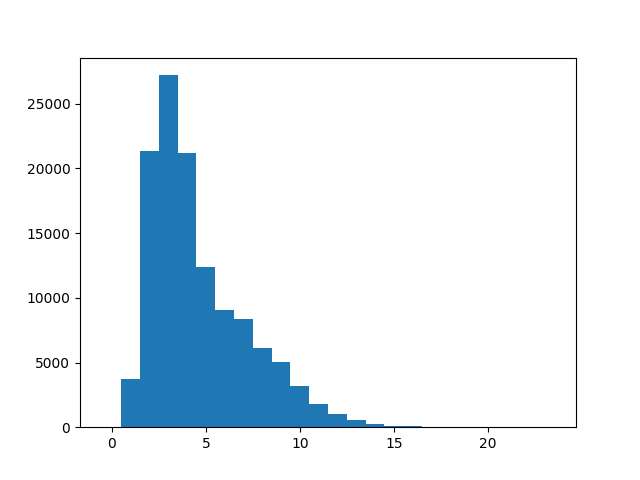
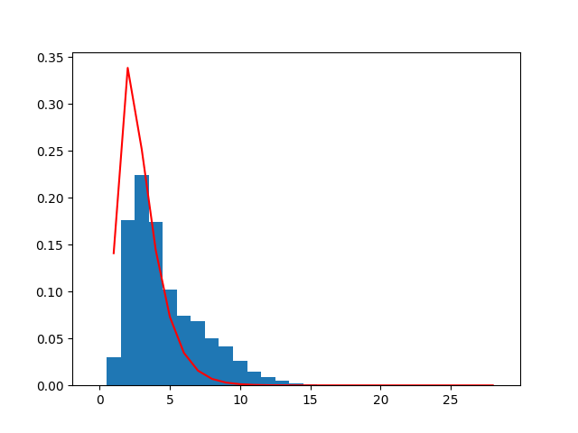

# Unit 2: Additional tasks

Please finish the "Apply what you learned" section before you begin these tasks.

Solutions will be made available at the end of class, in the same page as the solutions to the "Apply what you learned" exercises.

## Task 1: Maximum words and line lengths in characters

Print out the following information about the content of [pap.txt](pap.txt):

1. Maximum line length (characters, not words) and the line that had the maximum length
2. Maximum word length and the word that had the maximum length

## Task 2: Word length statistics

Print out the following descriptive statistics related to word length in [pap.txt](pap.txt):

1. Average word length ($\hat\mu$)
2. Mode (most common) word length
3. Least common word length
4. Median word length
   - Relevant Python features:
     - The `.sort()` method of lists
     - The mod (`%`) operator
     - The integer division (`//`) operator

## Task 3: [Sample variance](https://en.wikipedia.org/wiki/Variance#Sample_variance) and [sample standard deviation](https://en.wikipedia.org/wiki/Standard_deviation#Uncorrected_sample_standard_deviation) of mean word length

Use the following formulas for sample variance and sample standard deviation, using the following definitions:

- $n$ is the number of observations (the number of words, in our case)
- $x_1$ through $x_n$ are the values of the observations (in our case, the lengths of words 1 through $n$)
- $\hat\mu$ is the average word length that you calculated earlier in Task 2 part 1

$$\begin{aligned}
\text{sample variance} &= \frac{1}{n-1}\sum_{i=1}^n (x_i-\hat\mu)^2 \\
\text{sample standard deviation} &= \sqrt{\frac{1}{n-1}\sum_{i=1}^n (x_i-\hat\mu)^2}
\end{aligned}$$

If we haven't gone over it by this point, you can raise a number to a power in Python using the syntax `a**b`, which will give you $a^b$. You can use this syntax for square roots as well, if you choose the correct value of $b$.

## Task 4: Zipf distribution

From [Wikipedia](https://en.wikipedia.org/wiki/Zipf%27s_law):

> Zipf's Law states that when a list of measured values is sorted in decreasing order, the value of the $n$th entry is often inversely proportional to $n$.

Verify for yourself that the frequency of words in [pap.txt](pap.txt) is consistent with this law, using the following steps:

- For each word in [pap.txt](pap.txt), count the number of occurrences of the word
  - You will want to store the unique words somewhere, and then iterate through a second time to fill a second list with the counts for each unique word
  - If this is slow, you can look into using [dictionaries](https://docs.python.org/3.10/tutorial/datastructures.html#dictionaries) instead of lists
  - You can also save yourself a lot of time by directly using the `collections.Counter` class, which you can read about here: [Python 3.10 `collections.Counter` documentation](https://docs.python.org/3.10/library/collections.html?highlight=counter#collections.Counter)
- Rank these counts from largest to smallest
  - You can use the list method `.sort()` to sort a list. To specify that you want to sort from largest to smallest (instead of smallest to largest), pass the keyword argument `reverse=True`
  - If you used a Counter in the previous step, you can directly use the `.most_common()` method to sort the counts for you
- Print out the top 25 most frequent words and their frequencies
- Compare the variation in frequency with what you would expect from Zipf's law

## Task 5: Trying out `matplotlib` and other libraries

### Troubleshooting

If you are running into import issues with `matplotlib` or `numpy`, try the following in the `cmd` shell (accessible via the search menu and typing "cmd"):

```plaintext
python -m pip install matplotlib numpy
```

Let me know if this doesn't work.

### Part 1: Create a histogram

Create a histogram for word **length** frequency in [pap.txt](pap.txt), using the `matplotlib` plotting library.

Below is a template for your code, which needs to import `matplotlib` and call the `plt.hist()` function. I have also added a `numpy` import of `arange` which allows us to have the bins in the histogram align exactly with the numbers on the resulting plot.

```python
from matplotlib import pyplot as plt
from numpy import arange

with open('pap.txt', 'r') as f:
    ...

bins = arange(25) - 0.5
# you need to define word_lengths
plt.hist(word_lengths, bins)
plt.show()
```

You should get the following plot:



### Part 2: Fitting a curve

Try fitting a Gamma distribution to the word frequency data, and plot the result.

Here are the imports you should use:

```python
from matplotlib import pyplot as plt
from numpy import arange
import scipy.stats as stats
```

And here is some boilerplate that will plot the word histogram and the fit of the distribution:

```python
lengths.sort()
bins = arange(30) - 0.5
plt.hist(lengths, bins, density=True)

fit_alpha, fit_loc, fit_beta = stats.gamma.fit(lengths)
y = stats.gamma.pdf(lengths, a=fit_alpha, loc=fit_loc)
plt.plot(lengths, y, '-', color='red')

plt.show()
```

All you need to do is supply the word lengths as a list. 

You should get the following plot:


