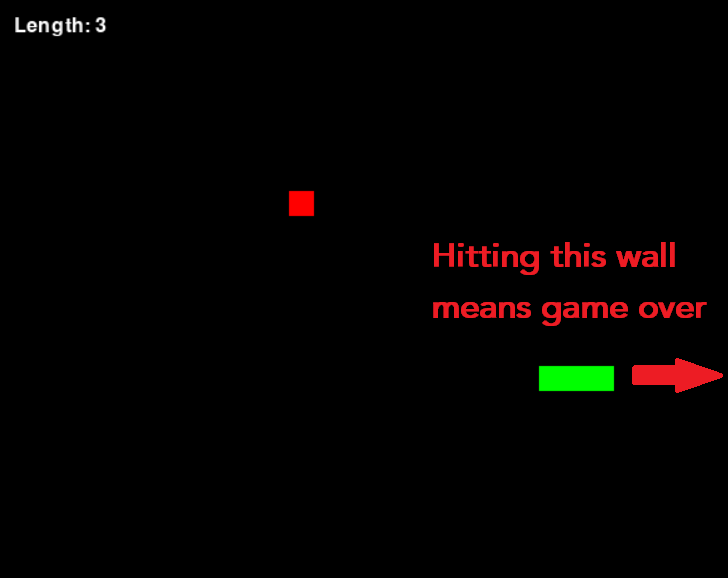

# Unit 10 Assessment

## Due date and submission

This assignment is due **April 12th** at 11:59 PM. Submit your solution on Brightspace, under the "Unit 10" assignment.

**Please copy your code into the text box, making sure to indent it properly with whitespace so that it appears the same as in IDLE or wherever you wrote the code. This will make it easier for me to grade.**

You can submit multiple times. I will only grade your last submission.

## Data

I have slightly modified the code for the Snake game to make it easier for you to do the assignment. If you had previously downloaded the game code, please replace it with the new version that I have uploaded (same link as before): [New version of Snake code](../csci13300_units/10_ex5.py)

## Task

Recall that in the original version of Snake that we saw in class, the game ended if the snake collided with a wall:

Modify the [code for the Snake game we saw in class](../csci13300_units/10_ex5.py) to make the snake come out on the opposite side of the screen instead of colliding with a wall:

## Step by step

1. Remove the lines of code that are used to detect wall collisions and that end the game when they occur.
2. Add lines of code that detect the following cases (should just be four separate if-statements):
   - The snake head is above the top edge of the screen
   - The snake head is below the bottom edge of the screen
   - The snake head is to the left of the left edge of the screen
   - The snake head is to the right of the right edge of the screen
3. Fill out the body of each of the if-statements with code to correct for the snake head's current position. If the snake head is out of bounds on the bottom, set its y-position to the top; if it's out of bounds on the left, set its x-position to the right, etc.
   - Remember that you can access the snake's head with `snake[0]`.
   - You should be able to just modify the position directly by using, e.g., `snake[0][0] = 0` to set the x-position of the snake's head to 0.

# Notes

You should be able to do all of the tasks with only the Python topics we covered in class so far.

If you want to use more complex functionality than what we discussed in class, the Python documentation may be helpful: [Python 3.10 documentation](https://docs.python.org/3.10/)

Additionally, the Pygame documentation may be helpful: [Pygame documentation](https://www.pygame.org/docs/)