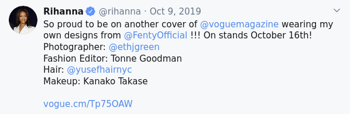

# Unit 5 Assessment

## Due date and submission

This assignment is due **March 8th** at 11:59 PM. Submit your solution on BrightSpace, under the "Unit 5" assignment.

**Please copy your code into the text box, making sure to indent it properly with whitespace so that it appears the same as in IDLE or wherever you wrote the code. This will make it easier for me to grade.**

You can submit multiple times. I will only grade your last submission.

## Data

This assignment uses the tweets contained in [all_tweets.zip](all_tweets.zip), which contains multiple files with tweets in them from various accounts on Twitter (now "X"). You can click on the filename to download the file. If it opens in your browser, can you use the shortcut `Ctrl + S` (or `Cmd + S` on macOS) to save the file to your computer.

You will need to decompress the zip archive and then copy the files in that folder into the folder with your script in it, so that the `.tweets` files are accessible from your script.

# Instructions

## Background

You have been given a collection of text files, each with 1000 tweets posted by various Twitter accounts. Each line in a file is a single tweet, so we can read each of the tweets like this:

```python
with open('nytimes.tweets') as lines:
    for line in lines:
        print(line)
```

If you are getting a decoding error, use this method to open the file using the UTF-8 encoding:

```python
with open('nytimes.tweets', encoding='utf8) as lines:
    for line in lines:
        print(line)
```

A username prefixed with `@` is called a **mention**. For example, the tweet below contains 4 mentions (`@voguemagazine`, `@FentyOfficial`, `@ethjgreen`, and `@yusefhairnyc`):



The above tweet is represented by the following string in the text file `rihanna.tweets`, in which any mention can be identified by a word that begins with `@`:

```plaintext
So proud to be on another cover of @voguemagazine wearing my own designs from @FentyOfficial !!! On stands October 16th! Photographer: @ethjgreen Fashion Editor: Tonne Goodman Hair: @yusefhairnyc Makeup: Kanako Takase  https//vogue.cm/Tp75OAW  pic.twitter.com/LU9TEe1NEh
```

## Task

Write a program to **find the most frequently mentioned usernames** in each of the provided files. To correctly identify mentions, we need to clean up each tweet, keeping only letters, digits, and the symbols `@` and `_`. After each tweet is cleaned up, we have to go through its words, and if the word starts with `@`, it is a mention.

### Step by step

1. Modify the `cleanedup` function that we wrote in lecture so that it keeps not only letters, but also digits (i.e., the characters `0123456789`) and the symbols `@` and `_`.
2. Write a new function `findMentions` that takes a filename as a parameter and reports the 3 usernames most frequently mentioned in that file. The function should create a dictionary of counts for all username mentions (words starting with `@`). After reading through the file and accumulating the counts for all mentioned usernames, use the dictionary to create a list like this:
```[[15: '@alice'], [20, '@bob'], [7, '@carol'], ... ```
Use `sort` (or `sorted`) to sort the above list and print out the 3 most frequently mentioned usernames.
3. Check each file in the current folder using `os.listdir('.')`: if the file name ends with `.tweets`, call `findMentions` on the file to find its most frequent mentions.

## Expected output

If you copy all the provided `.tweets` files into the folder with your script in it, running your script should give the following or something similar:

```plaintext
nytimes.tweets
     @caityweaver 3
     @nytmag 5
     @nytparenting 5

justinbieber.tweets
     @applemusic 15
     @theellenshow 15
     @skrillex 20

aoc.tweets
     @rashidatlaib 5
     @ayannapressley 6
     @ilhanmn 9

espn.tweets
     @nba 21
     @thecheckdown 29
     @kingjames 32

rihanna.tweets
     @rihanna 21
     @savagexfenty 29
     @fentybeauty 48

amyschumer.tweets
     @bridgeteverett 14
     @rachelfeinstein 15
     @comedycentral 49

ladygaga.tweets
     @ahsfx 10
     @btwfoundation 11
     @applemusic 13

BillGates.tweets
     @theeconomist 11
     @warrenbuffett 15
     @melindagates 18

BarackObama.tweets
     @ofa 5
     @vp 5
     @michelleobama 9

ID_AA_Carmack.tweets
     @boztank 3
     @joerogan 3
     @elonmusk 5

Kaepernick7.tweets
     @mikailsprice 26
     @darthkaepernick 28
     @kaepernick7 138

doctorow.tweets
     @cbc 3
     @doctorow 3
     @sensanders 7
```

# Notes

You should be able to do all of the tasks with only the Python topics we covered in class so far.

If you want to use more complex functionality than what we discussed in class, the Python documentation may be helpful: [Python 3.10 documentation](https://docs.python.org/3.10/)