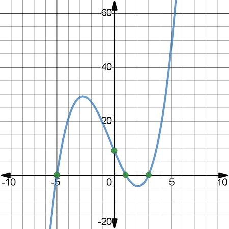

# Unit 7 Assessment

## Due date and submission

This assignment is due **March 22nd** at 11:59 PM. Submit your solution on BrightSpace, under the "Unit 7" assignment.

**Please copy your code into the text box, making sure to indent it properly with whitespace so that it appears the same as in IDLE or wherever you wrote the code. This will make it easier for me to grade.**

You can submit multiple times. I will only grade your last submission.

## Data

This assignment uses a text file `poly.txt`, which you can open by clicking here: [`poly.txt`](poly.txt)

# Instructions

## Background



A **cubic polynomial** is a function of $x$ of the form $Ax3 + Bx^2 + Cx + D$, where parameters $A$, $B$, $C$, and $D$ are real numbers. Consider three concrete examples:
$$\begin{gathered}
P_1(x) = x^3 - x^2 + 4x - 30 \\
P_2(x) = x^3 + 0.5 x^2 + x - 6 \\
P_3(x) = 3x^3 + 13.6x^2 + 13.2x + 37.8
\end{gathered}$$

A **root** of a cubic polynomial $P(x)$ is a value $r$ such that $P(r) = 0$. The intuitive description of a root $r$ is that $P(x)$ hits the $x$-axis at $x = r$. There may be multiple roots, because $P(x)$ may pass through (or touch) the $x$-axis multiple times (see the provided graph of a cubic polynomial).

For example, $r = 3$ is a root of $P_1$ as defined above, because $P_1(3) = 3^3 - 3^3 + 4 \cdot 3 - 30 = 27 - 9 + 12 - 30 = 0$:


In Python, a polynomial can be implemented as a function. The three examples above can be written as follows:

```python
def P1(x):
    return x*x*x - x*x + 4*x - 30

def P2(x):
    return x*x*x + 0.5*x*x + x - 6

def P3(x):
    return 3*x*x*x + 13.6*x*x + 13.2*x + 37.8
```

> **Note**: Roots of polynomials can be found using the function `goalSeek` (discussed in class), if you supply the tested polynomial function as the `function` parameter, set the target parameter equal to zero, and start with a good `lowLimit` and `highLimit` interval enclosing the root.
>
> **More important note**: The function `goalSeek` requires that the tested function `f` have the property that `f(lowLimit)` $\leq$ `f(target)` $\leq$ `f(highLimit)`. (We saw that there was an issue with `goalSeek` on question #4 in class when this condition did not hold.) All polynomials provided for this task will satisfy this requirement.

For this task, you are provided with the file `poly.txt` containing coefficients of 25 polynomials. The first few lines of the file look like this:

```plaintext
# A     B       C       D       Lo      Hi       Formula
3       -1.8    -7.6    -20.8   -4.28   11.88    3 x^3 - 1.8 x^2 - 7.6 x - 20.8
2       5       14      24      -6.57   0.73     2 x^3 + 5 x^2 + 14 x + 24
2.7     7.59    9.49    3.85    -1.86   5.85     2.7 x^3 + 7.59 x^2 + 9.49 x + 3.85
1       0       -8      -32     0.44    10.58    x^3 - 8 x - 32
```

The first line is a header, which you will have to skip when reading the file. (You can just check whether the line has a `#` at the start.) Each of the following lines starts with four coefficients $A$, $B$, $C$, and $D$, uniquely determining a polynomial $$Ax^3 + Bx^2 + Cx + D.$$

The coefficients are followed by the suggested values for the limits `Lo` and `Hi` on the search range. Each provided polynomial is guaranteed to have exactly one root in the interval `Lo` $\leq x \leq$ `Hi`. We will use `goalSeek` to find this root for each of the provided polynomials.

The last column of the file contains a conventional representation of the polynomial, which you can paste into [WolframAlpha](https://www.wolframalpha.com/) to confirm that your program correctly finds the roots. For example, here is the [response](https://www.wolframalpha.com/input/?i=3+x%5E3+-1.8+x%5E2-7.6+x-+20.8) for the first polynomial in the file, which says that the real root is equal to `2.6`.

## Task

In this task, we are going to write a program that finds the roots of cubic polynomials listed in the file [`poly.txt`](poly.txt) using `goalSeek` function.

### Step by step

1. Use `goalSeek` function to find the roots of the polynomials $P_1$, $P_2$, and $P_3$ listed in the introduction. The expected answers are `3`, `1.5`, and `-4.2` respectively. Choose the limits to contain the roots you are looking for (`-5` and `5` would suffice for these three polynomials). Confirm that your program is finding correct roots.
2. Read the file [`poly.txt`](poly.txt). Discard any line that starts with a `#` symbol (thus skipping the header). For each non-header line, split it and use the function `float` to extract $A$, $B$, $C$, $D$, `Lo`, and `Hi`. Print them out to confirm that your program correctly extracts these numbers.
   - Note: You can use operator `!=` to check that two values are not equal. For example, the condition `line[0] != '#'` evaluates to `True` if the first character in line is not equal to `#`.
3. Write a function `makePoly` that can generate a Python function representation of a cubic polynomial from its coefficients $A$, $B$, $C$, and $D$. For example, the polynomial function $P_1$ we used earlier could be created with the generator function as seen below:
```python
# original function P1
def P1(x):
    return x*x*x - x*x + 4*x - 30

# function P1 created using the makePoly function
P1 = makePoly(1, -1, 4, -30)
```
4. For each polynomial you read from the file, use `makePoly` to generate its Python function representation.
   - Run `goalSeek` on this function with given `Lo` and `Hi` limits to find the root. You can use [WolframAlpha](https://www.wolframalpha.com/) to check that the roots are correct.
   - After that, for each polynomial, print out its coefficients $A$, $B$, $C$, and $D$ followed by the root your found. Format the output nicely making sure the columns line up (we also added `->` to clearly separate the root from the coefficients):
```plaintext
    3.00    -1.80    -7.60   -20.80  ->      2.60
    2.00     5.00    14.00    24.00  ->     -2.00
    2.70     7.59     9.49     3.85  ->     -0.70
    1.00     0.00    -8.00   -32.00  ->      4.00
    1.80    -9.94   -29.38   -20.28  ->      7.80
    1.00    13.40    24.80    22.80  ->    -11.40
    2.10   -18.64    -8.44   -17.86  ->      9.40
    1.00    19.20    46.45    31.35  ->    -16.50
    3.00   -23.60    -1.20   -57.40  ->      8.20
    3.00   -54.70   -87.50  -238.80  ->     19.90
    2.50   -16.30   -31.24   -26.24  ->      8.20
    0.70    12.78    10.74     5.22  ->    -17.40
    3.00   -15.90   -16.90   -12.60  ->      6.30
    0.90     6.46    17.64    48.60  ->     -5.40
    0.90    -0.18   -25.18   -51.46  ->      6.20
    2.00    -5.00     7.00   -30.00  ->      3.00
    2.40   -13.12   -10.76   -74.80  ->      6.80
    2.00    18.20    23.20    56.70  ->     -8.10
    2.80    41.86    71.38    88.44  ->    -13.20
    2.00     6.20    11.00     4.80  ->     -0.60
    0.80    -2.46     2.96   -61.36  ->      5.20
    1.00    10.00    32.00    77.00  ->     -7.00
    1.00    -4.00    -3.00   -10.00  ->      5.00
    2.00     3.80     7.60    -0.80  ->      0.10
    2.00     5.60     6.90     3.90  ->     -1.30
```

# Notes

- If the roots you compute look similar but slightly different, choose a smaller `maxError`.

You should be able to do all of the tasks with only the Python topics we covered in class so far.

If you want to use more complex functionality than what we discussed in class, the Python documentation may be helpful: [Python 3.10 documentation](https://docs.python.org/3.10/)