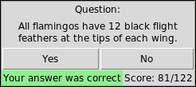
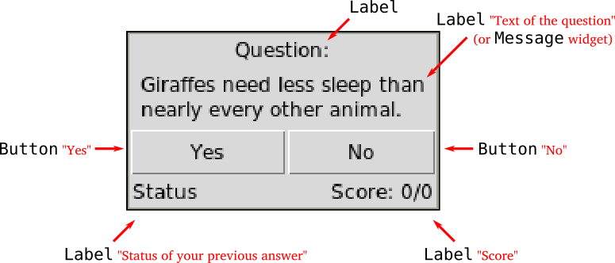
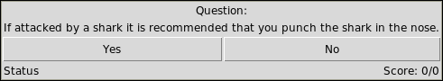
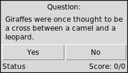
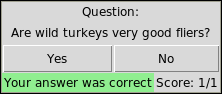
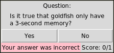
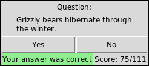
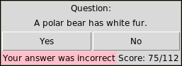

# Unit 8 Assessment

## Due date and submission

This assignment is due **March 29th** at 11:59 PM. Submit your solution on BrightSpace, under the "Unit 8" assignment.

**Please copy your code into the text box, making sure to indent it properly with whitespace so that it appears the same as in IDLE or wherever you wrote the code. This will make it easier for me to grade.**

You can submit multiple times. I will only grade your last submission.

## Data

This assignment uses two files:

1. The text file `animals.txt`, which you can open by clicking here: [`animals.txt`](animals.txt)
2. The Python file `readquiz.py`, which you can open by clicking here: [`readquiz.py`](readquiz.py)

# Instructions

## Task

In this task, we are going to write a program that implements a graphical quiz game.



You are provided with a text file containing quiz questions `animals.txt` ([source](https://github.com/uberspot/OpenTriviaQA)) and a module `readquiz.py` with a function `loadQuestions()` able to read Yes/No questions from the questions file. The function returns a list of the form:

```plaintext
[
  ['All dogs, cats and birds are colorblind.', False],
  ['Snake skin is covered in scales.', True],
  ['All tigers have stripes.', False],
  ...
]
```

Each element of the list is a pair containing a trivia-style statement string and a `True/False` value that determines whether the statement is true or not.

### Step by step

1. Load questions from the file `animals.txt` using the module `readquiz.py`
   - You will need at least three global variables: the list of questions, the number of times the player answered, and how many times they were correct:

     ```plaintext
     questions = readquiz.loadQuestions()
     total = 0
     correct = 0
     ```
2. Create a Tkinter interface, arranging widgets as close as possible to the following layout (you may use additional `Frame` widgets to help arrange buttons and labels):

  

  - When creating a label for the quiz question, you may use a `Message` widget instead of `Label` to get a multi-line text label. They are created the same way, but for `Message` you additionally specify its width:
    
    ```plaintext
    questionLabel = Label(root)
    ```

    ```plaintext
    questionLabel = Message(root, width=200)
    ```

    The difference between Label and Message:
  
    
  
    

  - The **Status** label in the bottom left is supposed to show if the player's previous answer was correct or incorrect
  - The **Score** label in bottom right is supposed to show the ratio of correct answers (i.e. `Score: correct/total`, initially, it should show `Score: 0/0`).
  - The game should show a randomly sampled trivia statement from the list and allow the player to press a button "**Yes**" or "**No**" if they agree or disagree with the statement.
  - To make the game work, add `['command']` functions for the buttons. If a correct button is pressed, it should change the **Status** label to `'Your answer was correct'` and its background to `'light green'`, otherwise change it to `'Your answer was incorrect'` and its background to `'pink'`. After that, it should load a new question, update globals correct and total, and update the **Score** label to show the updated ratio.
  
    
  
    
  
    After playing many rounds:
  
    
  
    
  
# Notes

- This assignment is harder than previous assignments. It's okay if you don't finish the whole thing, but **please at least get the window to pop up and display some question-related information, otherwise I can't give you full credit**.
  - If you are having trouble with the assignment, either ask questions during class (preferred) or come to office hours.
- There are many ways to make the buttons work correctly. We can give you one possible solution strategy:

  Define two functions for the buttons, describing what should happen when the player presses the correct button, and the incorrect one:
  
  ```python
  def goodAnswer():
    correct += 1
    total += 1
    ## Update Status and Score labels accordingly
    getNewQuestion()
  
  def badAnswer():
    correct += 0
    total += 1
    ## Update Status and Score labels accordingly
    getNewQuestion()
  ```
  
  The function `getNewQuestion()` should sample a new question, update the question label, and then reassign the `['command']` functions of the buttons. For example, if the question statement is `False`, then the **Yes** button should now execute `badAnswer`, and the **No** button should now execute `goodAnswer`.

  So in the proposed solution strategy, each time we update the question, we also update the behavior of the buttons.

You should be able to do all of the tasks with only the Python topics we covered in class so far.

If you want to use more complex functionality than what we discussed in class, the Python documentation may be helpful: [Python 3.10 documentation](https://docs.python.org/3.10/)