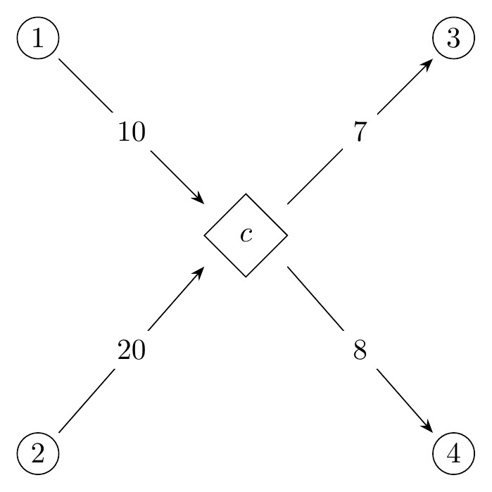

# Homeworks

Homework instructions/advice:

- **Problems will be posted here periodically, until the homework is due.** What is posted here is not necessarily the full homework assigment.
- **Show your work** for all homework problems. Check your work with WolframAlpha, ChatGPT, your calculator, Python, MATLAB, or whatever other resource you want to use.
- All questions on the homework are weighted equally.
- If you wait until the full homework is due to start, you may have more difficulty completing it on time.
- If you have questions on the homework, please ask them in class.
- If you think we didn't cover something in class, feel free to look it up, or ask a question in class.

---

## HW 1 (due 3/4/26 at 11:59 PM on Brightspace)

### Linear algebra review

#### Problem 1

Define $A$ and $b$ as follows:
$$A = \begin{bmatrix}
3 & 7 & 6 \\ 4 & 1 & 4 \\ 3 & 8 & 7
\end{bmatrix}, b = \begin{bmatrix}
2 \\ 4 \\ 6
\end{bmatrix}$$

Solve the matrix-vector equation $Ax = b$ using row-reduction. You should get integer results.

#### Problem 2

Define $A$ as follows:
$$A = \begin{bmatrix} 1 & 4 & 1 \\ 7 & 5 & 7 \\ 8 & 4 & 8 \end{bmatrix}$$

Show that $A$ is not invertible, and give a nontrivial solution to $Ax = 0$.

#### Problem 3

Define $A$ as follows:
$$A = \begin{bmatrix} 1 & 4 \\ 7 & 5 \end{bmatrix}$$

Find $AA^\intercal$.

#### Problem 4

Give a counterexample that shows matrix multiplication is not commutative for $2\times 2$ matrices.

#### Problem 5

Show that $I_2A = A$ for all matrices $A$ with dimension $2\times 2$.

### Linear programming basics

#### Problem 7

A small bakery makes two types of muffins: blueberry and chocolate chip. Each blueberry muffin requires 0.5 cups of flour and 0.25 cups of sugar. Each chocolate chip muffin requires 0.5 cups of flour and 0.5 cups of sugar. The bakery has 20 cups of flour and 15 cups of sugar available each day. The profit from each blueberry muffin is \$2, and the profit from each chocolate chip muffin is \$3. The bakery wants to maximize its daily profit.

You will create and solve a linear program that models the above scenario:

- Define the decision variables you will use in your LP model, and state what they represent. (You should have two decision variables.)
- List the constraints in your LP model in terms of the decision variables you created.
- State the objective function of your LP model in terms of the decision variables.
- Convert the LP to canonical form (if necessary), and state the contents of $A$, $c$, and $b$, as they correspond respectively to the matrix and vectors in the canonical $\max c^\intercal x$ s.t. $Ax\leq b$, $x\geq 0$ format.
- Graph the feasible region of your LP model (since you should have 2 decision variables, you should be able to graph this in 2 dimensions) and determine the solution.

#### Problem 8

Note: this problem is a little more complex than the above problem, but is still possible to model using 3 decision variables (for the obvious quantities).

A furniture company produces three types of chairs: basic, deluxe, and executive. The production of each chair requires different amounts of wood, labor, and fabric. The company wants to maximize its profit given its limited daily resources.

The company's goal is to maximize profit. The profit for each chair type, along with its material cost, is as follows:

- Basic chair: \$100
  - Wood cost: 3 units
  - Labor cost: 2 units
  - Fabric cost: 2 units
- Deluxe chair: \$150
  - Wood cost: 5 units
  - Labor cost: 3 units
  - Fabric cost: 6 units
- Executive chair: \$250
  - Wood cost: 4 units
  - Labor cost: 5 units
  - Fabric cost: 8 units

The company has these additional constraints:

- The amount of wood used must be less than or equal to the amount of fabric used.
- The total number of labor used cannot exceed 20 units.
- Any unused labor (under the 20-unit limit) costs the company \$20 per unit, due to the additional upkeep on the company ping-pong tables that the employees use when not working.

You will create (but not solve) a linear program that models the above problem:

- Define the decision variables you will use in your LP model, and state what they represent. (You should have three decision variables.)
- List the constraints in your LP model in terms of the decision variables you created.
- State the objective function of your LP model in terms of the decision variables.
- Convert the LP to canonical form (if necessary), and state the contents of $A$, $c$, and $b$, as they correspond respectively to the matrix and vectors in the canonical $\max c^\intercal x$ s.t. $Ax\leq b$, $x\geq 0$ format.

### Linear programming geometry

#### Problem 9

Give an example for each of the following types of linear programs:

- An unbounded LP with 4 decision variables
- An infeasible LP with 3 decision variables
- An LP with one decision variable that is unbounded in one direction, but still has an optimal solution because our objective points the opposite way

#### Problem 10

In class, we saw that the intersection of convex sets was convex. Is the union of convex sets convex? If so, explain. If not, provide a counterexample.

### LP solving and big-O notation

#### Problem 11

Determine the big-O time complexity of the function `f` in the below piece of code, in terms of the length of the array `A`.

```python
def f(A, target):
    # A is a sorted list of integers
    lo = 0
    hi = len(A) - 1
    while lo <= hi:
        mid = (hi + lo) // 2
        m = A[mid]
        if m == target:
            return mid
        elif m < target:
            lo = mid + 1
        else:
            hi = mid - 1
    return -1 
```

#### Problem 12

Determine the big-O time complexity of the function `g` in the below piece of code, in terms of `n`.

```python
def g(n):
    x = 0
    i = 0
    j = 1
    while i < n:
        x += 1
        i += j
        j += 1
    return x
```

#### Problem 13

State the time complexities for each of the following operations, in big-O notation. (Disregard amortized vs. non-amortized time.)

- Checking whether an integer is in a hashset
- Finding an item in an unsorted list
- Finding an item in a sorted list (as in Problem 11)
- Sorting a list with merge sort

#### Problem 14

What does it mean for something to run in polynomial time? Why is it important?

### Discrete math review and modeling max flow as an LP

#### Problem 15

Evaluate this expression:

$$\sum x \quad \forall x, 0\leq x\leq 100, x\equiv 0 \bmod 6$$

#### Problem 16

Evaluate this expression:

$$\prod_{i=1}^5 i^2$$

#### Problem 17

Formalize as a linear constraint each of the following statements, given a graph $G = (V,E)$ and cost function $C: E\to \mathbb N$.

Use the "$\forall$" and "$\sum$" notation we covered in class, and use a decision variable $x_{i,j}$ to denote the flow from vertex $i$ to vertex $j$.

Note that $C$ is *cost*, not capacity. To determine the cost of an edge $(i,j)\in E$ in an LP solution, you must multiply the cost of the edge $C((i,j))$ by the amount of flow through $(i,j)$, given by $x_{i,j}$.

Constraints to model:

- The flow of every edge is at least 1.
- The cost of the flow on each path of length 2 in the graph is at most 5.
  - Note: a path of length $n$ is an $n$-tuple of vertices $(v_1, v_2, \dots, v_n)$, where $\{(v_1, v_2), (v_2, v_3), \dots, (v_{n-1}, v_n)\}\subseteq E$.
- The amount of flow going into each vertex is twice the amount of flow leaving that vertex.

#### Problem 18

Suppose you are given a graph $G = (V,E)$ and vertices $s,t\in V$, and you are asked to model the maximum flow problem for $G$. However, you are also given a new type of vertex called a **combiner**, which requires two units of input flow for each unit of output flow, as seen in the below examples. A combiner can have any number of inputs or outputs, but the totals have to have a 2:1 ratio.

{width=350px}

{width=350px}

Combiners are also vertices, in the set $C\subset V$.

**LP Model**: Describe how you will model max flow on $G$ as an LP with this modification:

1. What are your decision variables?
2. What are your constraints?
3. What will the objective function be?

**Integrality**: In class, we saw that for max flow, if all capacities were integer then all flows would be integer in the solution to the LP. Does that hold for this formulation? If so, explain why. If not, provide a counterexample.

### LP modeling capabilities

#### Problem 19

For each of the following constraints on the decision variable $x$, state whether they can or cannot be modeled by a linear program:

1. $x$ is an integer.
2. The values $x$ can take on are within the range $[3, 7]$.
3. The values $x$ can take on are within the range $(3, 7)$.
4. The values $x$ can take on are in the set $\{0.5, 1.2\}$.

#### Problem 20

For each of the following constraints on the decision variable $x$, state whether they can or cannot be modeled by a linear program:

1. Either $x \leq 1$ or $x \geq 3$.
2. The absolute value of $x$, $|x|$, is greater than or equal to 3.
3. The absolute value of $x$, $|x|$, is less than or equal to 1.
4. $x^2 \leq 5$
5. $\sqrt x \leq 9$
6. $x + x/2 + x/4 + x/8 + x/16 \leq 2x$

**END OF HW 1**

---
